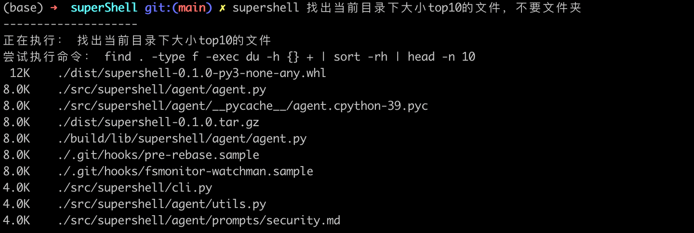

# SuperShell

SuperShell 是一个智能的命令行工具，可以将自然语言指令转换为具体的 Shell 命令并执行。

## 安装

```bash
brew tap justdark/supershell
brew install supershell
```

## 配置

首次使用前需要配置 API 密钥：

```bash
supershell --config access_key=your_api_key
```

可配置的选项包括：
- `access_key`: API 访问密钥
- `api_address`: API 地址（默认为 https://api.deepseek.com/v1/chat/completions）
- `model_name`: 模型名称（默认为 deepseek-chat）

示例：
```bash
supershell --config api_address=https://your-api-address-with-completions
supershell --config model_name=your-model-name
```

## 使用方法

直接输入自然语言指令：

```bash
supershell "如果当前目录下有txt文件，把所有文件内容都拼接到一起"
supershell "系统设置为暗色模式"
supershell "当前目录下的txt文件打包成tar.gz文件"
supershell "找出系统里大小top10的文件，不要文件夹"
```

### 搜索大文件


### git操作，会要求输入信息再执行


### 删除或者修改系统设置时会有交互确认

------


TODO:目前主要的promtp是中文，且指明系统为mac，后续会替换和自动识别

## 快速使用

可以设置命令别名以更方便地使用：

```bash
# 在 ~/.bashrc 或 ~/.zshrc 中添加以下内容
alias ss='supershell'
# 重新加载配置
source ~/.bashrc  # 如果使用 bash
# 或
source ~/.zshrc   # 如果使用 zsh
```


工具会：
1. 理解你的自然语言指令
2. 转换为对应的 Shell 命令
3. 在执行危险操作前请求确认
4. 执行命令并返回结果

## 特性

- 自然语言理解：无需记忆复杂的命令语法
- 智能确认：执行危险操作前会请求用户确认
- 上下文感知：可以理解和执行多步骤的复杂指令
- 配置灵活：支持自定义 API 地址和模型

## 许可证
MIT License